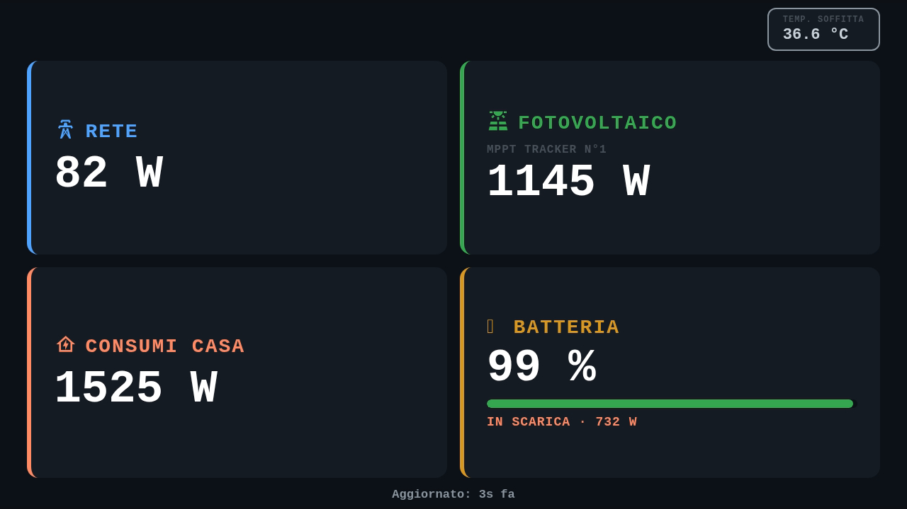
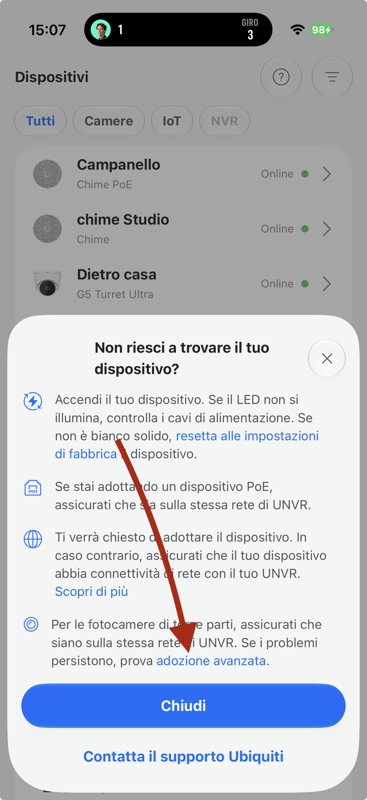
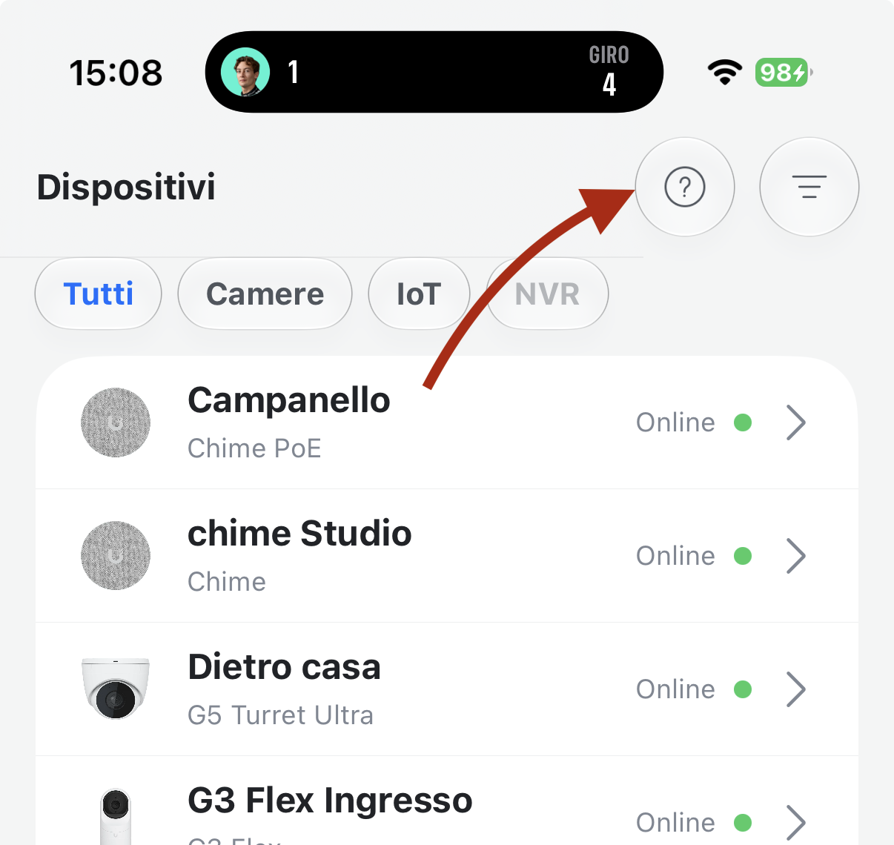

# VRM to Video

Turn your Victron Energy system into a virtual ONVIF camera — stream a live energy dashboard directly into UniFi Protect (or any ONVIF-compatible NVR) as if it were a real IP camera.



---

## What is this?

If you have a Victron Energy installation (Multiplus, MPPT solar charger, Pylontech batteries, etc.) connected to VRM, this project lets you visualize your energy data as a **live video feed** inside your NVR's camera grid — no extra screens, no dashboards to open, just a tile in your existing security camera view.

Every few seconds the system fetches live data from the **Victron VRM API**, renders a clean HTML dashboard, encodes it as H.264 video via ffmpeg, and serves it over RTSP. An ONVIF server makes the stream discoverable by UniFi Protect automatically.

---

## Pipeline

```
Victron VRM API
      │  (live data, every 5s)
      ▼
 screenshotter.js
  ├─ fetches telemetry (grid, PV, battery, loads, temperature)
  ├─ renders HTML dashboard via headless Chromium (Puppeteer)
  └─ pipes PNG frames to ffmpeg
      │
      ▼
   ffmpeg
  ├─ H.264 baseline profile, level 3.1
  ├─ 1280×720 @ 5fps
  └─ pushes RTSP stream to mediamtx
      │
      ▼
  mediamtx          ← RTSP server (also exposes WebRTC)
      │
      ▼
  ONVIF server      ← makes the camera discoverable on the LAN
      │
      ▼
 UniFi Protect / any ONVIF NVR
```

---

## Dashboard cards

| Card | Victron data source | VRM attribute ID |
|------|---------------------|-----------------|
| **Rete** (Grid power) | Grid meter L1 — `/Ac/L1/Power` | 379 |
| **Fotovoltaico** (PV) | MPPT Tracker 1 — `/Pv/0/P` | 802 |
| **Consumi Casa** (Loads) | VE.Bus output L1 — `/Ac/Out/L1/P` | 29 |
| **Batteria** (Battery SOC) | Battery Monitor — `/Soc` | 51 |
| **Battery Power** | System — `/Dc/Battery/Power` | 243 |
| **Temp. Soffitta** | Temperature sensor — `/Temperature` | 450 |

The battery card shows a colour-coded level bar (green → yellow → red) and displays **In carica** (charging) or **In scarica** (discharging) with the current power flow.

---

## Requirements

- A machine running **Docker + Docker Compose** on your local network
- A Victron installation connected to **VRM** with an API token
- UniFi Protect or any **ONVIF-compatible NVR** (optional — the raw RTSP stream works with VLC too)

---

## Setup

### 1. Clone the repo

```bash
git clone https://github.com/Progetto-Hydratech/VRM_to_Video.git
cd VRM_to_Video
```

### 2. Create a `.env` file

```env
VRM_TOKEN=your_vrm_api_token
VRM_SITE_ID=your_installation_id
HOST_IP=192.168.1.x        # LAN IP of the machine running Docker
FPS=5
```

> **VRM_SITE_ID**: visible in the VRM portal URL — `vrm.victronenergy.com/installation/XXXXXX`  
> **VRM_TOKEN**: generate one in VRM → top-right menu → **Access Tokens**

### 3. Start the stack

```bash
docker compose up -d
```

### 4. Watch the stream (optional test)

Open in VLC or any RTSP player:
```
rtsp://HOST_IP:8554/victron
```

Or open the WebRTC viewer in a browser:
```
http://HOST_IP:8888/victron
```

### 5. Add to UniFi Protect

1. Open **UniFi Protect** and go to **Settings → System**
2. Enable **Discover Third-Party Cameras**
3. Navigate to the **UniFi Devices** page — the VRM camera should appear in the list ready for adoption
4. Select **Click to Adopt**
5. In the popup, enter the credentials: Username `admin` — Password `admin`

If the camera does **not** appear automatically, use **Advanced Adoption**:

**Step 1** — In the UniFi Devices page, click the **?** (help) button in the top-left corner of the page:



**Step 2** — Click **Advanced Adoption**, then enter your `HOST_IP` as the camera IP and `31472` as the port:



> **Troubleshooting**: if adoption fails, make sure the machine running Docker is on the **same network subnet** as your UniFi NVR, and that port `31472` (TCP) and `3702` (UDP) are not blocked by a firewall.

---

## Ports

| Port | Protocol | Purpose |
|------|----------|---------|
| `8554` | TCP | RTSP stream — point your NVR here |
| `8888` | TCP | WebRTC viewer (browser-friendly preview) |
| `31472` | TCP | ONVIF device service (camera discovery) |
| `3702` | UDP | WS-Discovery multicast (ONVIF auto-discovery) |

---

## Stack

| Service | Technology | Role |
|---------|-----------|------|
| `mediamtx` | `bluenviron/mediamtx` | RTSP / WebRTC server |
| `screenshotter` | Node.js + Chromium + ffmpeg | Fetches VRM data, renders dashboard, encodes H.264 |
| `onvif` | Python | Exposes an ONVIF-compliant device endpoint for NVR discovery |

---

## Compatibility

Tested with:
- **UniFi Protect** (UDM Pro / UNVR) — ONVIF auto-discovery
- **VLC** — direct RTSP playback
- Victron **Cerbo GX** with MPPT solar charger, Multiplus II, Pylontech battery, and energy meter

---

## License

MIT — free to use, modify and share.
